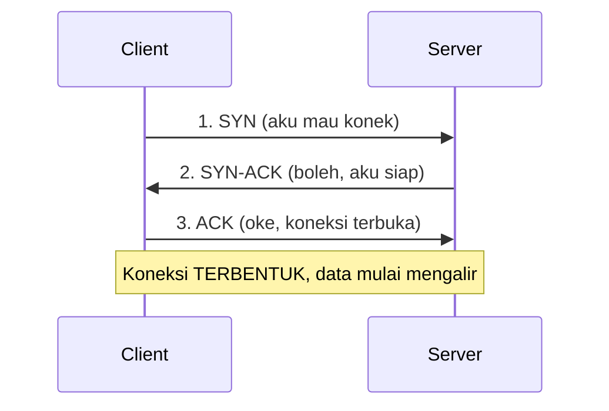
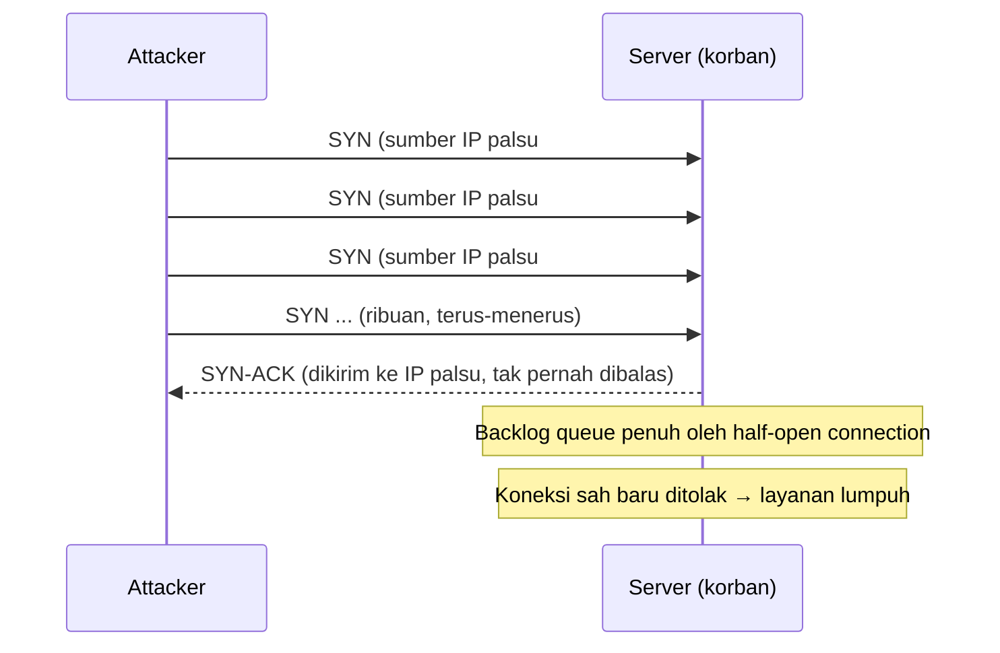
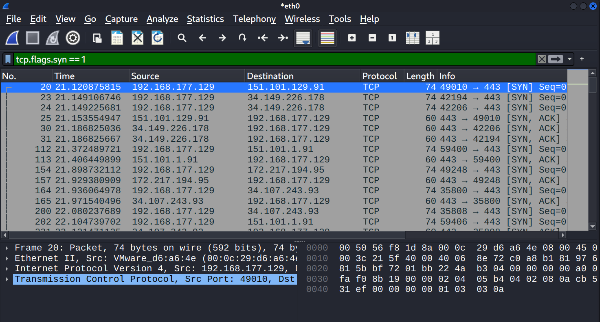
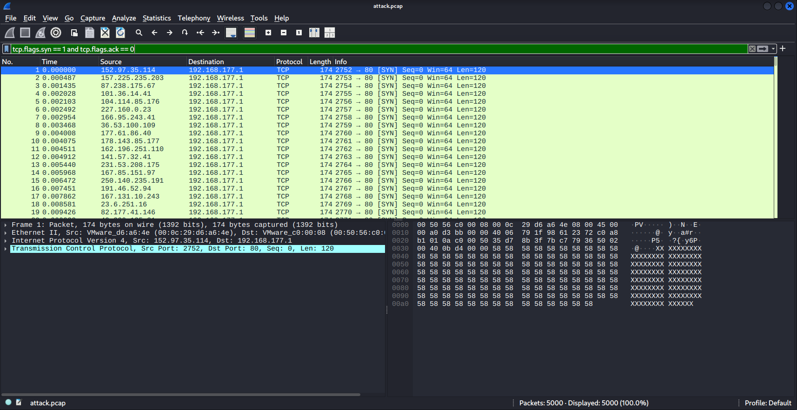
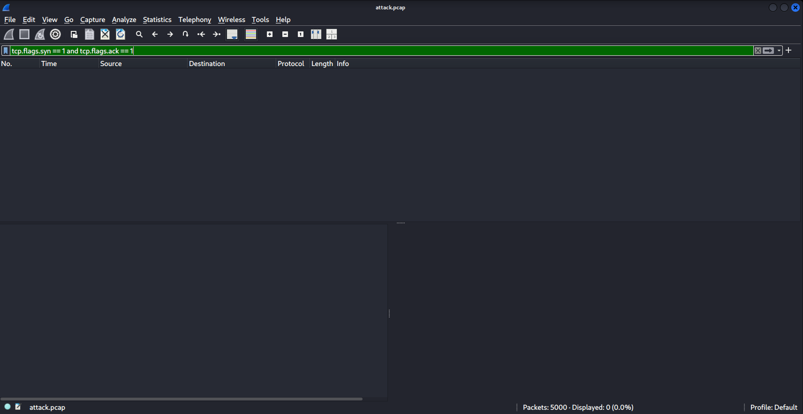
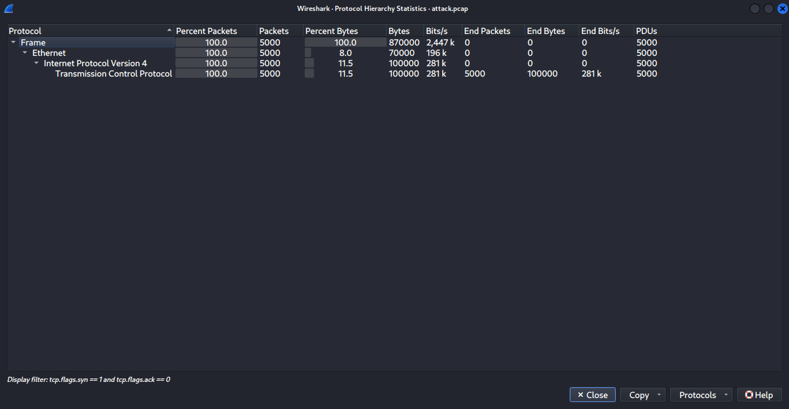
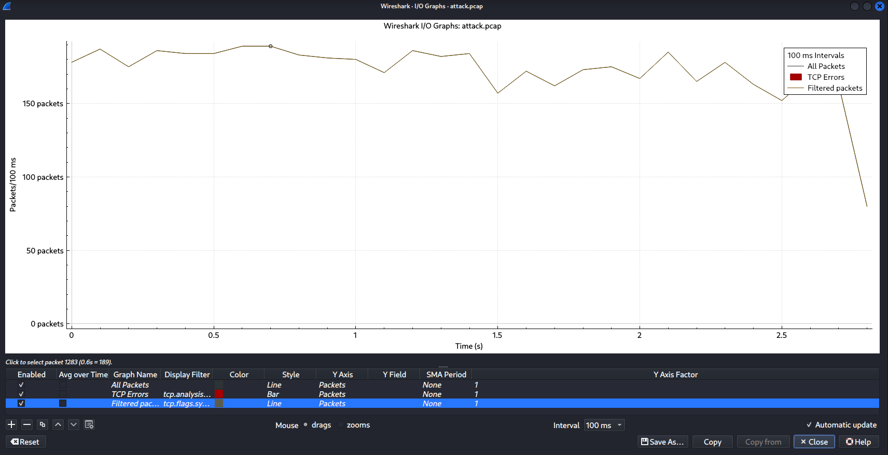
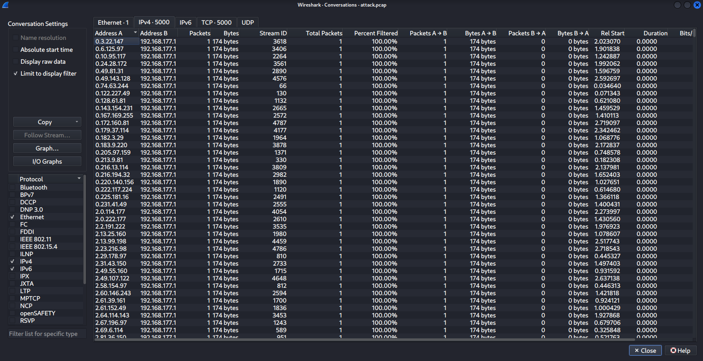

# Class Activity 02 — Simulasi & Deteksi TCP SYN Flood

- **Mata Kuliah:** Keamanan Jaringan Komputer 
- **Nama:** Ryan Adya Purwanto 
- **NRP:** 5027231046 
- **Kelas:** A 
- **Tanggal:** 13 September 2026

Laporan ini mendokumentasikan simulasi serangan **TCP SYN Flood** dari mesin penyerang (Kali Linux) ke mesin korban (Windows), lalu mendeteksi dan menganalisisnya menggunakan Wireshark. Seluruh pengujian dilakukan di jaringan lab tertutup (VMware NAT) tanpa menyentuh jaringan publik.

---

## Daftar Isi

1. [Tujuan](#1-tujuan)
2. [Dasar Teori](#2-dasar-teori)
3. [Topologi & Lingkungan Lab](#3-topologi--lingkungan-lab)
4. [Langkah Simulasi](#4-langkah-simulasi)
5. [Metodologi Perekaman](#5-metodologi-perekaman)
6. [Hasil & Analisis](#6-hasil--analisis)
7. [Jawaban Diskusi](#7-jawaban-diskusi)
8. [Refleksi & Teknik Mitigasi](#8-refleksi--teknik-mitigasi)
9. [Kesimpulan](#9-kesimpulan)
10. [Referensi](#10-referensi)
11. [Struktur Repositori](#11-struktur-repositori)

---

## 1. Tujuan

- Memahami konsep TCP *three-way handshake* dan cara kerja serangan SYN Flood.
- Melakukan simulasi SYN Flood terkendali menggunakan `hping3`.
- Mendeteksi serangan di Wireshark melalui *display filter* dan metrik statistik.
- Membedakan trafik normal dari trafik serangan lewat analisis visual (I/O Graph & Protocol Hierarchy).

---

## 2. Dasar Teori

### 2.1 TCP Three-Way Handshake

Sebelum dua host bertukar data lewat TCP, keduanya membangun koneksi melalui tiga langkah:



Saat server menerima SYN, ia menyisihkan sedikit memori (masuk ke *backlog queue*) untuk mengingat calon koneksi itu, lalu membalas SYN-ACK dan menunggu ACK terakhir dari client. Koneksi yang menunggu ACK ini disebut **half-open connection**.

### 2.2 Apa itu SYN Flood

SYN Flood menyalahgunakan langkah ke-3 yang sengaja **tidak pernah** diselesaikan oleh penyerang:



Penyerang membanjiri korban dengan SYN dalam jumlah sangat besar tanpa pernah mengirim ACK. Setiap SYN memaksa korban mengalokasikan memori dan menunggu. Ketika *backlog queue* penuh, korban tidak lagi bisa menerima koneksi baru dari pengguna sah — inilah **resource exhaustion** (kehabisan sumber daya) yang berujung *Denial of Service*.

Umumnya penyerang memakai **IP spoofing** (sumber alamat dipalsukan acak) supaya SYN-ACK dari korban terkirim ke alamat yang salah, sehingga handshake mustahil selesai dan penyerang sulit dilacak.

---

## 3. Topologi & Lingkungan Lab

```
┌─────────────────────────┐         SYN Flood        ┌─────────────────────────┐
│   ATTACKER               │  ───────────────────▶    │   VICTIM                 │
│   Kali Linux (VMware)    │   ribuan SYN, IP palsu   │   Windows (host)         │
│   192.168.177.129        │                          │   192.168.177.1          │
└─────────────────────────┘                          └─────────────────────────┘
            Jaringan VMware NAT (VMnet8) — 192.168.177.0/24 — lab tertutup
```

| Peran | Sistem | IP Address | Keterangan |
|---|---|---|---|
| Attacker | Kali Linux (VMware) | `192.168.177.129` | Menjalankan hping3 & Wireshark |
| Victim | Windows (host) | `192.168.177.1` | Adapter VMware VMnet8 |
| Gateway NAT | Perangkat virtual VMware | `192.168.177.2` | Bukan target |

**Verifikasi konektivitas:** Ping ICMP ke korban gagal (100% loss) karena Windows Firewall memblokir ICMP secara default. Ini **bukan** tanda jaringan putus — jalur TCP tetap hidup, dibuktikan oleh SYN yang berhasil terkirim ke korban pada capture serangan.

**Perangkat lunak:** Kali Linux, `hping3`, `tcpdump`, Wireshark.

---

## 4. Langkah Simulasi

### 4.1 Memastikan hping3 tersedia

```bash
which hping3
# /usr/sbin/hping3
```

### 4.2 Menjalankan serangan SYN Flood

```bash
sudo hping3 -c 5000 -d 120 -S -w 64 -p 80 -i u200 --rand-source 192.168.177.1
```

| Parameter | Nilai | Keterangan |
|---|---|---|
| `-c 5000` | 5000 | Jumlah paket yang dikirim |
| `-d 120` | 120 byte | Ukuran payload |
| `-S` | — | Menyalakan flag SYN |
| `-w 64` | 64 | Ukuran TCP window |
| `-p 80` | port 80 | Target port (HTTP) |
| `-i u200` | 200 µs | Jeda antar paket (≈ 5000 paket/detik) |
| `--rand-source` | — | Memalsukan IP sumber secara acak (spoofing) |
| `192.168.177.1` | — | IP korban (Windows) |

Keluaran hping3:

```
5000 packets transmitted, 0 packets received, 100% packet loss
```

`0 packets received` adalah bukti pertama: tidak satu pun SYN mendapat balasan yang kembali ke penyerang — konsekuensi langsung dari IP spoofing.

---

## 5. Metodologi Perekaman

Dibuat **dua rekaman terpisah** untuk perbandingan:

| File | Isi | Cara perekaman |
|---|---|---|
| `baseline.pcapng` | Trafik normal (browsing biasa) | Wireshark live di `eth0` |
| `attack.pcap` | Serangan SYN Flood | `tcpdump` ke file |

```bash
# Merekam serangan ke file (ringan, tanpa GUI)
sudo tcpdump -i eth0 -w ~/kjk-week2/attack.pcap tcp
```

### Catatan metodologi (penyesuaian dari perintah asli)

Perintah pada lembar tugas menggunakan `--flood` (kirim secepat mungkin) sambil merekam *live* di Wireshark. Kombinasi ini **membekukan VM** karena Wireshark harus merender ratusan ribu paket per detik secara langsung. Dua penyesuaian diterapkan agar pengujian tetap stabil tanpa mengubah karakter serangan:

1. **Kecepatan dibatasi** dengan `-i u200` (± 5000 paket/detik) menggantikan `--flood`, sehingga volume terkendali.
2. **Perekaman dipindah ke `tcpdump`** yang menulis langsung ke file tanpa merender ke layar, lalu file dibuka di Wireshark setelah selesai.

Penyesuaian ini justru mencerminkan praktik lab yang baik: serangan diuji dalam skala terkendali di lingkungan tertutup. Pola trafiknya identik dengan flood sesungguhnya (banyak SYN, IP palsu, tanpa balasan), hanya lajunya yang dijaga.

---

## 6. Hasil & Analisis

### 6.1 Baseline — trafik normal



Pada trafik normal, setiap **SYN** dari `192.168.177.129` selalu dibalas **SYN, ACK** oleh server tujuan (lihat paket ke server port 443). Komunikasi berlangsung **dua arah** dan handshake diselesaikan. Inilah bentuk koneksi sehat yang akan menjadi pembanding.

### 6.2 Serangan — banjir SYN dengan IP palsu

Filter: `tcp.flags.syn == 1 and tcp.flags.ack == 0`



Temuan:

- **5.000 paket SYN** membanjiri korban (status bar: *Displayed: 5000, 100%*).
- Kolom **Source berisi IP yang acak dan tidak pernah berulang** (152.97.35.114, 157.225.235.203, 87.238.175.67, …) — efek `--rand-source`.
- Semua paket menuju **192.168.177.1 port 80**, semuanya ber-flag **[SYN]** dengan `Win=64` dan `Len=120`, persis sesuai parameter serangan.

### 6.3 Perbandingan — SYN-ACK nyaris nol

Filter: `tcp.flags.syn == 1 and tcp.flags.ack == 1`



Status bar: **Displayed: 0 (0.0%)**. Tidak ada satu pun SYN-ACK dalam capture serangan, berbanding lurus dengan `100% packet loss` pada hping3.

| Metrik | Baseline (normal) | Serangan |
|---|---|---|
| SYN (`syn=1, ack=0`) | Wajar, seimbang | **5.000** |
| SYN-ACK (`syn=1, ack=1`) | Ada, mengikuti tiap SYN | **0** |
| Sumber IP | Tetap (IP Kali) | **5.000 IP acak** |
| Arah komunikasi | Dua arah | Satu arah |

### 6.4 Protocol Hierarchy



- Total **5.000 paket, 100% TCP** — tidak ada protokol lain, ciri khas trafik yang dibangkitkan mesin (bukan aktivitas manusia yang beragam).
- Volume **870.000 byte**, laju rata-rata **± 2.447 kbps**.
- Seluruh 5.000 paket bertipe TCP tanpa payload aplikasi yang berarti — hanya rangka SYN berulang.

### 6.5 I/O Graph



Dengan interval 100 ms, grafik menunjukkan laju **± 175–190 paket per 100 ms** (≈ 1.800 paket/detik) yang bertahan konstan sepanjang ± 2,8 detik. Trafik naik seketika ke nilai tinggi lalu datar — pola "dinding" yang khas serangan otomatis, sangat berbeda dari trafik manusia yang naik-turun tidak teratur.

### 6.6 Bukti IP Spoofing (Conversations)



Tab **IPv4** menampilkan **5.000 percakapan (conversations)** — artinya ada **5.000 alamat sumber berbeda**, dan setiap alamat hanya mengirim **1 paket (174 byte)** lalu tidak pernah muncul lagi. Trafik sah tidak berperilaku begini; ini sidik jari IP spoofing yang paling jelas.

---

## 7. Jawaban Diskusi

**a. Apa gejala khas serangan SYN Flood berdasarkan hasil capture?**

- Lonjakan mendadak paket **SYN** dalam jumlah sangat besar ke satu tujuan dan satu port (5.000 SYN ke `192.168.177.1:80`).
- **Ketidakseimbangan ekstrem** antara SYN dan SYN-ACK: 5.000 SYN berbanding 0 SYN-ACK.
- **Alamat sumber acak dan tidak berulang** dalam jumlah masif (5.000 IP unik, masing-masing 1 paket).
- Trafik **100% TCP** dengan laju tinggi yang konstan (pola "dinding" di I/O Graph).

**b. Mengapa jumlah SYN-ACK tetap sedikit meskipun SYN sangat banyak?**

Karena `--rand-source` memalsukan alamat pengirim setiap SYN. Ketika korban membalas SYN-ACK, balasan itu dikirim ke **IP palsu yang acak**, bukan ke mesin penyerang. Akibatnya SYN-ACK tidak pernah kembali ke penyerang (terlihat sebagai `100% packet loss` di hping3 dan `Displayed: 0` di capture penyerang), dan handshake tidak akan pernah selesai. Selain itu port 80 pada korban tertutup, sehingga tidak ada layanan yang benar-benar menegakkan handshake.

**c. Apa dampak IP spoofing terhadap deteksi dan mitigasi?**

- **Deteksi:** memblokir berdasarkan IP sumber jadi percuma — 5.000 IP berbeda, masing-masing 1 paket. Tidak ada satu alamat "jahat" yang bisa ditandai. Deteksi harus bergeser ke *pola perilaku* (rasio SYN vs SYN-ACK, laju SYN per detik).
- **Mitigasi:** blokir per-IP dan *rate-limit* per-sumber tidak efektif karena tiap paket seolah datang dari sumber baru. Diperlukan mekanisme yang tidak bergantung pada identitas sumber, seperti **SYN cookies**.
- **Atribusi:** alamat asli penyerang tersembunyi, sehingga pelacakan sumber serangan menjadi sangat sulit.

---

## 8. Refleksi & Teknik Mitigasi

**Refleksi.** Praktik ini menunjukkan bahwa SYN Flood tidak perlu mengeksploitasi celah kode apa pun — ia hanya menyalahgunakan cara kerja normal TCP handshake. Dari sisi deteksi, satu perbandingan sederhana (jumlah SYN vs SYN-ACK) sudah cukup kuat untuk mengenali serangan, dan IP spoofing membuat pertahanan berbasis alamat sumber menjadi tidak berguna. Kontras antara baseline (dua arah, seimbang) dan serangan (satu arah, 5.000:0) adalah inti dari deteksi ini.

**Teknik mitigasi umum:**

| Teknik | Cara kerja |
|---|---|
| **SYN cookies** | Server tidak menyimpan state saat SYN datang; informasi koneksi dikodekan ke dalam nomor urut SYN-ACK. Backlog tidak bisa dipenuhi half-open connection. |
| **Backlog tuning** | Memperbesar antrean koneksi setengah-terbuka dan memperpendek batas waktu tunggu, agar entri basi cepat dibuang. |
| **Rate limiting / filtering** | Membatasi jumlah SYN per detik yang diterima dari satu segmen, serta *ingress filtering* untuk membuang paket dengan alamat sumber yang jelas palsu. |
| **Firewall / reverse proxy** | Perangkat di depan server menegakkan handshake terlebih dahulu (SYN proxy); hanya koneksi yang benar-benar selesai yang diteruskan ke server. |
| **Layanan anti-DDoS** | Menyerap dan menyaring trafik dalam skala besar di sisi jaringan sebelum mencapai server. |

---

## 9. Kesimpulan

Simulasi berhasil menunjukkan seluruh siklus serangan SYN Flood: 5.000 paket SYN dengan 5.000 alamat sumber palsu dikirim ke korban, tanpa satu pun SYN-ACK yang kembali. Wireshark mendeteksinya dengan jelas melalui perbandingan *display filter* (`syn=1,ack=0` = 5.000 vs `syn=1,ack=1` = 0), Protocol Hierarchy (100% TCP), I/O Graph (laju konstan tinggi), dan Conversations (5.000 sumber unik). Kontras tegas terhadap baseline yang sehat membuktikan bahwa gejala SYN Flood dapat dikenali dari pola trafiknya, dan mitigasi paling tepat adalah yang tidak bergantung pada identitas alamat sumber, terutama **SYN cookies**.

---

## 10. Referensi

- Firewall.cx — *Performing a TCP SYN Flood Attack & Detecting it with Wireshark*.
- Wikipedia — *SYN flood*.
- Imperva — *SYN Flood DDoS Attack — Mitigation Techniques*.
- RFC 793 — *Transmission Control Protocol*.
- RFC 4987 — *TCP SYN Flooding Attacks and Common Mitigations*.

---

## 11. Struktur Repositori

```
Tugas Week 2/
├── README.md
├── screenshots/
│   ├── 01-baseline-handshake.png
│   ├── 02-attack-syn-flood.png
│   ├── 03-attack-syn-ack-kosong.png
│   ├── 04-protocol-hierarchy.png
│   ├── 05-io-graph.png
│   └── 06-conversations-spoofing.png
└── captures/
    ├── baseline.pcapng
    └── attack.pcap
```


